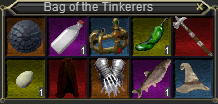
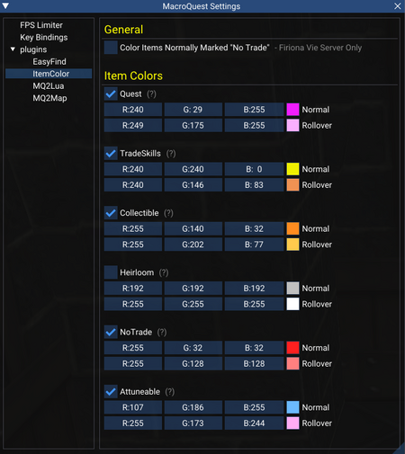

---
tags:
  - plugin
resource_link: "https://www.redguides.com/community/resources/mqitemcolor.2188/"
support_link: "https://www.redguides.com/community/threads/mqitemcolor.78596/"
repository: "https://gitlab.com/Ortster/MQItemColor"
config: "MQItemColor.ini"
authors: "Ortster, eqmule"
tagline: "MQItemColor changes the background color of items in your player inventory, bank, or shared bank slots."
acknowledgements: "MQ2ItemColors"
---

# MQItemColor

<!--desc-start-->
MQItemColor changes the background color of items in your player inventory, bank, or shared bank slots. Giving you a quick visual cue for what you have in your messy bags!

Currently supports coloring of items marked Quest, Tradeskill, Collectible, Heirloom, No Trade, or Attunable.
<!--desc-end-->

## Settings

MQItemColor **(NOTE there is no 2 on MQ)**

Currently supports coloring of items marked Quest, Tradeskill, Collectible, Heirloom, No Trade, or Attunable.

Each color option can be toggled on/off or have custom colors set using the ini file. Changes in the ini will take effect once plugin is reloaded.

### MQItemColor Configuration File

MQItemColour.ini file example:

```ini
[General]
FVNormalNoTrade=0
[Quest]
QuestOn=1
QuestNormal=0xFFF01DFF
QuestRollover=0xFFF9AFFF
[TradeSkills]
TradeSkillsOn=1
TradeSkillsNormal=0xFFF0F000
TradeSkillsRollover=0xFFF09253
[Collectible]
CollectibleOn=1
CollectibleNormal=0xFFFF8C20
CollectibleRollover=0xFFFFCA4D
[Heirloom]
HeirloomOn=1
HeirloomNormal=0xFFC0C0C0
HeirloomRollover=0xFFFFFFFF
[NoTrade]
NoTradeOn=1
NoTradeNormal=0xFFFF2020
NoTradeRollover=0xFFFF8080
[Attuneable]
AttuneableOn=1
AttuneableNormal=0xFF6BBAFF
AttuneableRollover=0xFFFFADF4
```

Note: How No Trade works on Firiona.

By default items that are No Trade on other servers but not on Firiona will not be colored.
If for some reason you want to color items that are Tradeable on FV but No Trade on other servers, you can set the "FVNormalNoTrade" setting to 1.

### Default Colors (In Coloring Order)

| Item Type | Color |
|-----------|-------|
| Quest | Purple (F01DFF) |
| Tradeskills | Yellow (F0F000) |
| Collectible | Orange (FF8C20) |
| Heirloom | Silver (C0C0C0) - Off By Default |
| No Trade | Red (FF2020) |
| Attunable | Cyan (6BBAFF) |



### Change Options Using the Built in Setting UI.

Changes made this way will save to the ini and take effect immediately.



### To load MQItemColor

Use the following command to load MQItemColor. (NOTE there is no 2 on MQ.)

`/plugin mqitemcolor`
